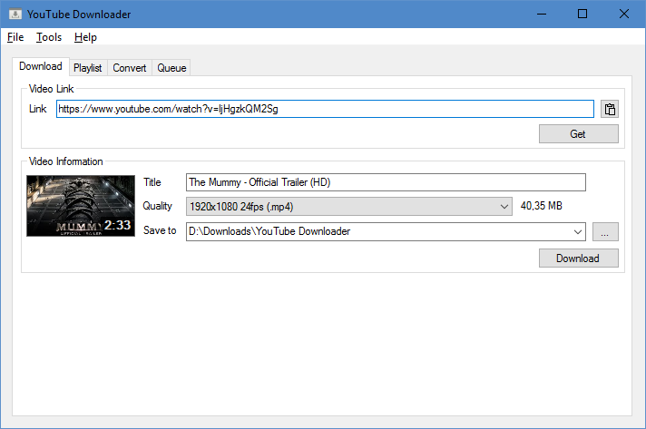

YouTube Downloader
==================

YouTube Downloader is a program to download YouTube & Twitch videos using [youtube-dl](http://rg3.github.io/youtube-dl/).

#### Features
- Playlist downloading
 - Download all or selected videos
 - Select quality, Highest, Medium or Low
 - Options to reverse, number prefix, etc.
- Convert videos to .mp3 files using [FFmpeg](http://www.ffmpeg.org/)
 - Convert whole folders with extension filtering
- Automatically convert to .mp3 after download
- Crop videos & .mp3 files

Screenshots
-----------

See [Images](Images) folder.

Licenses
--------

- [FFmpeg](https://www.ffmpeg.org/) is licensed under GNU LGPL v2.1.
- [FileDownloader](http://www.codeproject.com/Articles/35954/C-NET-Background-File-Downloader) is licensed under GPL v3.0
- [Json.NET](http://james.newtonking.com/json) is licensed under MIT.
- [youtube-dl](http://rg3.github.io/youtube-dl/) is [Unlicensed](http://unlicense.org/) (?).

Copyright
---------

All rights on source code and libraries belong to their respective owners.

Credits
-------

- Thanks to [Open Icon Library](http://openiconlibrary.sourceforge.net/) for the icon background.
- Thanks to [VisualPharm](http://www.visualpharm.com/) for the download part of the icon.
- Thanks to [Icons8](https://icons8.com/) for Playlist options icon.
